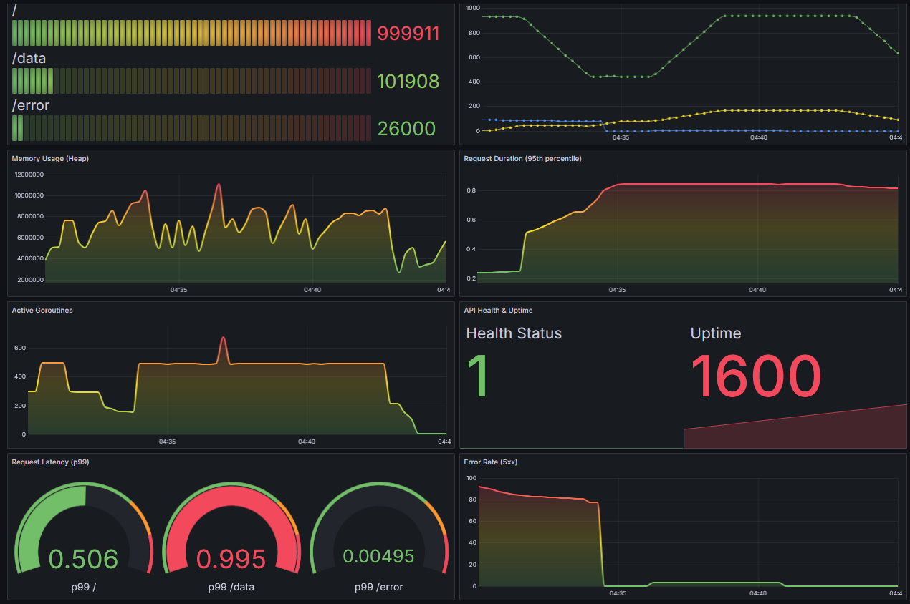

# DeepWatch

[](https://github.com/apolinario0x21/DeepWatch/actions/workflows/ci.yml)
[](go.mod)
[](LICENSE)


## 📖 Sobre o Projeto
Projeto de Observabilidade com Go, Prometheus & Grafana. Este projeto demonstra a implementação de um sistema completo de monitoramento e observabilidade para uma aplicação escrita em Go. As métricas são expostas pela aplicação, coletadas pelo Prometheus, visualizadas em dashboards no Grafana e configuradas para enviar alertas via Alertmanager.

## 🛠 Tecnologias Utilizadas

| **Component** | **Technology**                     |
|---------------|------------------------------------|
| Application   | Go (Golang)                        |
| Metrics       | Prometheus                         |
| Visualization | Grafana                            |
| Alerting      | Alertmanager                       |
| Orchestration | Docker & Docker Compose                     |
| CI/CD         | GitHub Actions                     |
| Qualidade     | golangci-lint, go test -race       |
| Load Testing  | Hey (ferramenta de teste de carga) |


## Funcionalidades

- API REST instrumentada com métricas customizadas
- Métricas de Sistema: Goroutines, uso de memória, uptime
- Métricas de Negócio: Latência, throughput, taxa de erro
- Alertas Proativos: Alta latência e taxa de erro
- Dashboard Grafana: Visualizações em tempo real
- Health Checks: Monitoramento de saúde da aplicação

## Acessos

| Ferramenta     | Endpoint                   | 
|:---------------|:---------------------------| 
| `Aplicação Go` | `http://localhost:8080`    | 
| `Prometheus`   | `http://localhost:9090`    | 
| `Grafana`      | `http://localhost:3000`    | 
| `Alertmanager` | `http://localhost:9093`    |
| `WebHook`      | `https://webhook.site`    |

## 🗂 Estrutura do Projeto

```
DeepWatch/
├── cmd/deepwatch/          # entrypoint (main mínimo: config + composição)
├── internal/
│   ├── config/             # leitura de configuração via variáveis de ambiente
│   ├── metrics/            # definição/registro das métricas + middleware
│   ├── handlers/           # handlers de negócio + health check
│   └── server/             # http.Server, rotas e graceful shutdown
├── prometheus/             # config do Prometheus + regras de alerta
├── alertmanager/           # config do Alertmanager (webhook via envsubst)
├── grafana/provisioning/   # datasource + dashboard (Golden Signals)
├── .github/workflows/      # pipelines de CI e release (ghcr.io)
├── Dockerfile              # multi-stage, binário estático, distroless não-root
├── docker-compose.yml      # orquestração da stack com healthchecks
├── Makefile                # atalhos de build, test, lint, up/down…
└── .golangci.yml           # configuração do linter
```

## 🔬 Detalhes Técnicos

<details>
<summary><strong>Endpoints da API</strong></summary>

| Método | Endpoint  | Descrição                                  |
| :----- | :-------- | :----------------------------------------- |
| `GET`  | `/`       | Endpoint principal para testes de carga.   |
| `GET`  | `/data`   | Simula um endpoint com latência controlada.|
| `GET`  | `/error`  | Endpoint que sempre retorna um erro 500.   |
| `GET`  | `/health` | Retorna o status de saúde (`200 OK` / `503`).|
| `GET`  | `/metrics`| Expõe as métricas para o Prometheus.       |

</details>


## ⚠️ Alertas Configurados

<details>
<summary><strong>🔴 HighErrorRate</strong></summary>

- **Condição:** > 10 erros 5xx em 2 minutos
- **Severidade:** Critical
- **Duração:** 10 segundos

</details>

<details>
<summary><strong>🔴 HighLatency</strong></summary>

- **Condição:** P99 > 500ms
- **Severidade:** Critical
- **Duração:** 1 minuto

</details>


## 📊 Métricas Capturadas

<details>
<summary><strong>Métricas de Requisição</strong></summary>

- `api_requests_total` — Total de requisições HTTP
- `api_request_duration_seconds` — Duração das requisições (histograma)

</details>

<details>
<summary><strong>Métricas de Sistema</strong></summary>

- `api_goroutines_count` — Número de goroutines ativas
- `api_memory_usage_bytes` — Uso de memória (HeapAlloc)
- `api_uptime_seconds` — Tempo de atividade da aplicação

</details>

<details>
<summary><strong>Métricas de Dependências</strong></summary>

- `api_external_dependencies_duration_seconds` — Latência de APIs externas

</details>

<details>
<summary><strong>Health Check</strong></summary>

- `api_healthcheck_status` — Status de saúde (1=UP, 0=DOWN). Reflete o estado
  real da aplicação: cai para `0` durante o graceful shutdown, quando o
  endpoint `/health` passa a responder `503`.

</details>


## 🚀 Como Executar

1.  Clone este repositório:
    ```bash
    git clone git@github.com:apolinario0x21/DeepWatch.git
    cd DeepWatch
    ```

2.  Crie um arquivo `.env` a partir do exemplo:
    ```bash
    cp .env.example .env
    ```

3.  No arquivo `.env`, substitua os valores das variáveis, como a `WEBHOOK_URL` e a senha do Grafana.

4.  Execute a stack completa com Docker Compose:
    ```bash
    docker compose up -d --build
    # ou, com o Makefile:
    make up
    ```
    A aplicação sobe em uma imagem mínima (distroless, ~22MB) rodando como
    usuário **não-root**, e todos os serviços possuem `healthcheck`.

5.  Acesse os serviços:
    - **Sua Aplicação Go:** `http://localhost:8080`
    - **Prometheus:** `http://localhost:9090`
    - **Grafana:** `http://localhost:3000` (usuário: admin, senha: a que você definiu no `.env`)
    - **Alertmanager:** `http://localhost:9093`

    > As portas do host são configuráveis (`APP_HOST_PORT`, `GRAFANA_HOST_PORT`,
    > etc.) caso já estejam em uso na sua máquina — veja o `.env.example`.

## 🧑‍💻 Desenvolvimento

Requer **Go 1.26+**. Os principais comandos estão no `Makefile` (rode `make help`):

| Comando          | Descrição                                              |
| :--------------- | :----------------------------------------------------- |
| `make run`       | Executa a aplicação localmente                         |
| `make build`     | Compila o binário estático em `./bin`                  |
| `make test`      | Testes com race detector (`go test ./... -race`)       |
| `make cover`     | Cobertura (`coverage.out` + `coverage.html`)           |
| `make lint`      | Análise estática com `golangci-lint`                   |
| `make fmt`       | Formata o código (`gofmt -s`)                          |
| `make docker-build` | Constrói a imagem Docker da aplicação               |
| `make up` / `make down` | Sobe / derruba a stack completa                 |

Os pacotes de negócio são cobertos por testes unitários (`net/http/httptest`
e `testutil` do `client_golang`), exercitando handlers, health check,
middleware de métricas, configuração e o graceful shutdown.

## 🔄 CI/CD

O projeto usa **GitHub Actions**:

- **CI** (`.github/workflows/ci.yml`): a cada push/PR na `main` roda
  `go build`, `go vet`, `golangci-lint` e `go test -race -cover`, além de um
  `docker build` (sem push), com cache de módulos.
- **Release** (`.github/workflows/release.yml`): ao criar uma tag `v*`,
  publica a imagem em `ghcr.io/apolinario0x21/deepwatch`.

## 📊 Dashboards

O Grafana é provisionado com um dashboard inicial que monitora os Golden Signals (Acompanhamento de Latência, Tráfego, Erros e Saturação):

- **Latência:** Duração das requisições (p95, p99).
- **Tráfego:** Total de requisições e taxa por segundo (RPS).
- **Erros:** Taxa de erros 5xx.
- **Saturação:** Uso de memória e número de Goroutines.





## 🔬 Simulando Carga e Testando Alertas

Após iniciar a stack, você pode usar a ferramenta de teste de carga `hey` para simular diferentes cenários de tráfego e validar os dashboards e alertas em tempo real.

Abaixo estão alguns exemplos de comandos. Para testes simultâneos (ex: latência e erro ao mesmo tempo), execute cada comando em uma janela de terminal separada.

| Objetivo | Endpoint Alvo | Comando `hey` Sugerido |
| :--- | :--- | :--- |
| Simular tráfego de fundo geral | `/` | `hey -z 1m -c 10 http://localhost:8080/` |
| Testar o alerta de **alta latência** (p99) | `/data` | `hey -z 2m -c 5 http://localhost:8080/data` |
| Testar o alerta de **alta taxa de erros** | `/error` | `hey -n 20 -c 5 http://localhost:8080/error` |
| Fazer uma verificação de saúde em rajada | `/health`| `hey -n 100 -c 10 http://localhost:8080/health`|

---

#### Entendendo os Parâmetros do `hey`

-   `**-z**`: Define a **duração** do teste (ex: `1m` para 1 minuto, `30s` para 30 segundos). Ideal para testes contínuos.
-   `**-n**`: Define o **número total de requisições** a serem enviadas. Ideal para testes de rajada (`burst`).
-   `**-c**`: Define o número de **trabalhadores concorrentes**, simulando múltiplos usuários acessando o sistema ao mesmo tempo.


## 🤝 Contribuindo

1. Fork o projeto
2. Crie uma feature branch (`git checkout -b feature/nova-funcionalidade`)
3. Commit suas mudanças (`git commit -am 'Adiciona nova funcionalidade'`)
4. Push para a branch (`git push origin feature/nova-funcionalidade`)
5. Abra um Pull Request

## 📄 Licença

Este projeto está sob a licença MIT. Veja o arquivo [LICENSE](LICENSE) para mais detalhes.